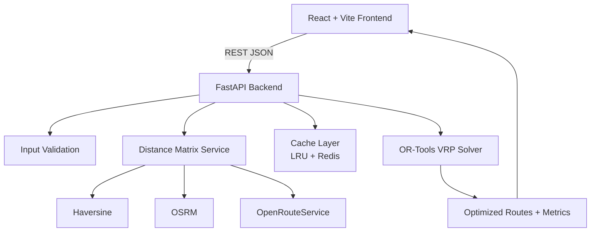

# 🚚 VRP Logistics — Last-Mile Route Optimization

A production-ready Vehicle Routing Problem (VRP) platform for planning delivery routes with vehicle capacity and route-time constraints.

## 📸 Screenshots / Demo

> Add project visuals under `/home/runner/work/vrp-logistics/vrp-logistics/docs/assets/` and keep these links updated.


## 📌 Project Overview

VRP Logistics helps logistics teams optimize delivery operations by turning depot, delivery, and fleet inputs into feasible multi-vehicle routes. The system combines a FastAPI backend, OR-Tools optimization engine, and React dashboard for route visualization and analysis.

## ❗ Problem Statement

Manual route planning does not scale for high-volume last-mile operations. Teams need to assign hundreds of deliveries across multiple vehicles while respecting:
- vehicle capacity
- per-route time limits
- real road-network distance and travel-time estimates

## ✅ Solution Approach

The platform solves a capacitated VRP with a global route duration constraint:
1. Validate and normalize input data.
2. Build distance/time matrices (Haversine, OSRM, or OpenRouteService).
3. Cache matrix computations for repeat workloads.
4. Solve with Google OR-Tools (CVRP + Guided Local Search).
5. Return assigned routes, route metrics, and unassigned stops.
6. Visualize output in an interactive frontend map and charts.

## 🏗 Architecture Diagram



Detailed architecture and API flow: [`docs/ARCHITECTURE.md`](docs/ARCHITECTURE.md)

## 🧰 Tech Stack

- **Backend:** FastAPI, Python 3.11, Pydantic, Uvicorn
- **Optimization:** Google OR-Tools
- **Frontend:** React, Vite, Leaflet, Recharts
- **Caching:** Redis + in-process LRU cache
- **Routing Data:** OSRM / OpenRouteService / Haversine fallback
- **Containerization:** Docker, Docker Compose

## 🚀 Installation Instructions

### Option A: Local Setup

```bash
git clone https://github.com/Siva-Balan-V/vrp-logistics.git
cd vrp-logistics

# Backend
cd backend
python -m venv .venv
# macOS/Linux: source .venv/bin/activate
# Windows PowerShell: Set-ExecutionPolicy -Scope Process -ExecutionPolicy Bypass; .\.venv\Scripts\Activate.ps1
pip install -r requirements.txt
cp ../.env.example .env
python -m uvicorn app.main:app --reload --port 8000

# Frontend (new terminal)
cd ../frontend
npm install
npm run dev
```

### Option B: Docker Compose

```bash
cp .env.example .env
docker compose up --build
```

- Frontend: `http://localhost:5173`
- Backend API docs: `http://localhost:8000/docs`

## 🧪 Sample Input and Output

### Sample Input (`POST /api/v1/optimize-routes`)

```json
{
  "depot": { "id": 0, "lat": 51.5074, "lon": -0.1278 },
  "deliveries": [
    { "id": 1, "lat": 51.5150, "lon": -0.0720, "demand": 2 }
  ],
  "vehicles": {
    "count": 18,
    "capacity": 50,
    "max_route_duration_seconds": 9000
  }
}
```

### Sample Output

```json
{
  "job_id": "3fa85f64-5717-4562-b3fc-2c963f66afa6",
  "status": "success",
  "solver_time_seconds": 4.2,
  "vehicles": [
    {
      "vehicle_id": 1,
      "route": [0, 23, 45, 0],
      "distance_km": 35.4,
      "time_minutes": 130.0
    }
  ],
  "unassigned": [101, 203]
}
```

## 🔮 Future Enhancements

- Time windows per delivery (VRPTW)
- Real-time traffic-aware routing
- Multi-depot optimization
- Live optimization progress via WebSocket
- Route export formats (CSV, GPX)
- Kubernetes deployment support

## 📄 License — Fair Use Policy

This project is shared for educational, learning, portfolio, and non-abusive evaluation use.

Fair use expectations:
- Do not use this project for unlawful or harmful operations.
- Do not misrepresent this work as solely your own without attribution.
- Respect third-party service terms (e.g., OSRM/ORS usage limits and policies).
- Verify legal/commercial compliance before production deployment.

If you need commercial or enterprise usage rights, contact the repository owner for explicit permission.
